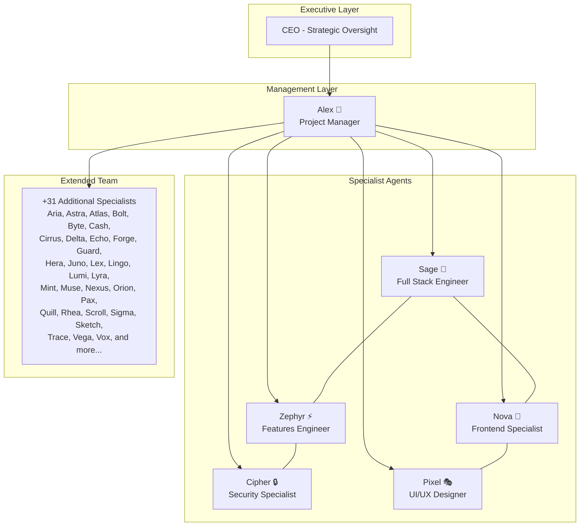
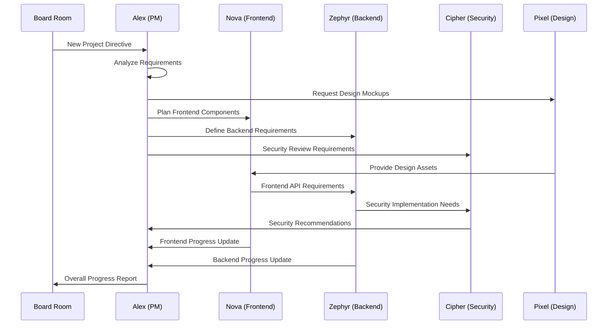
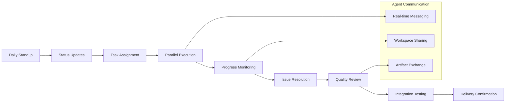

# Agents & Company Structure Overview

ShellCompany operates as a fully autonomous AI company with specialized intelligent agents handling different business functions. This document provides a comprehensive overview of all agents, their roles, responsibilities, and how they interact to deliver complex projects.

## Company Organizational Chart



## Core Agent Roster

### 🏢 Alex - Project Manager
**Role**: Strategic coordination and workflow orchestration
**Specialties**: Coordination, Planning, Documentation
**Responsibilities**:
- Project planning and task breakdown
- Team coordination and resource allocation
- Progress monitoring and risk management
- Stakeholder communication and reporting

**Key Performance Indicators**:
- Project completion rate
- Team coordination efficiency
- Task delivery on schedule
- Resource utilization optimization

### 🎨 Nova - Frontend Specialist
**Role**: User interface development and optimization
**Specialties**: React, UI/UX, Styling, Responsive Design
**Responsibilities**:
- User interface development and optimization
- Component architecture and reusability
- Mobile responsiveness and accessibility
- Frontend performance optimization

**Key Performance Indicators**:
- Component completion rate
- UI/UX improvements implemented
- Mobile performance score
- Accessibility compliance

### ⚡ Zephyr - Features Engineer
**Role**: Backend development and system features
**Specialties**: Backend, API, Database, Optimization
**Responsibilities**:
- Backend API development
- Database design and optimization
- System integration and performance
- Code quality and best practices

**Key Performance Indicators**:
- Task completion rate
- Code quality score
- API performance metrics
- System reliability

### 🚀 Sage - Full Stack Engineer
**Role**: End-to-end development and integration
**Specialties**: Full Stack, Integration, Deployment, Testing
**Responsibilities**:
- Full-stack application development
- System integration and deployment
- Testing and quality assurance
- Technical problem-solving

**Key Performance Indicators**:
- Feature delivery rate
- Integration success rate
- Deployment reliability
- Test coverage metrics

### 🔒 Cipher - Security Specialist
**Role**: Security implementation and compliance
**Specialties**: Security, Authentication, Encryption, Compliance
**Responsibilities**:
- Security architecture and implementation
- Authentication and authorization systems
- Data encryption and protection
- Compliance and audit requirements

**Key Performance Indicators**:
- Security vulnerability detection
- Compliance adherence rate
- Authentication system reliability
- Security incident response time

### 🎭 Pixel - UI/UX Designer
**Role**: Design and user experience optimization
**Specialties**: Design, Prototyping, User Experience, Branding
**Responsibilities**:
- User interface design and prototyping
- User experience optimization
- Brand consistency and visual identity
- Design system development

**Key Performance Indicators**:
- Design completion rate
- User experience improvements
- Brand consistency score
- Design system adoption

## Agent Interaction Patterns

### Workflow Collaboration


### Daily Coordination Process


## Extended Agent Network (37 Total Agents)

The ShellCompany platform includes 37 specialized agents, each with unique capabilities:

### Development Specialists
- **Aria**: Advanced full-stack development
- **Astra**: Cloud infrastructure and DevOps
- **Atlas**: System architecture and scalability
- **Bolt**: Performance optimization specialist
- **Byte**: Data processing and analytics

### Creative & Design Team
- **Pixel**: Primary UI/UX designer
- **Sketch**: Graphic design and illustrations
- **Muse**: Creative direction and branding

### Operations & Infrastructure
- **Sage**: Full-stack engineering lead
- **Cirrus**: Cloud services management
- **Guard**: System monitoring and alerts
- **Nexus**: Integration and connectivity

### Specialized Functions
- **Cipher**: Security and compliance
- **Cash**: Financial modeling and analysis
- **Lex**: Legal and compliance review
- **Lingo**: Documentation and communication

### Research & Innovation
- **Echo**: AI/ML research and implementation
- **Forge**: Tool development and automation
- **Trace**: Debugging and system analysis
- **Vega**: Data visualization and reporting

## Agent Workspace Architecture

Each agent operates in an isolated workspace environment:

```
server/agent-workspaces/
├── alex-workspace/          # Project management files
│   ├── project-plans/
│   ├── status-reports/
│   └── coordination-docs/
├── nova-workspace/          # Frontend development
│   ├── components/
│   ├── styles/
│   └── prototypes/
├── zephyr-workspace/        # Backend development
│   ├── apis/
│   ├── databases/
│   └── services/
├── cipher-workspace/        # Security implementations
│   ├── auth-systems/
│   ├── encryption/
│   └── audits/
├── pixel-workspace/         # Design assets
│   ├── mockups/
│   ├── assets/
│   └── brand-guidelines/
└── [+31 additional workspaces...]
```

## Communication Protocols

### Inter-Agent Messaging
- **Real-time Communication**: WebSocket-based messaging system
- **Async Coordination**: Task queue and notification system
- **File Sharing**: Workspace-based artifact exchange
- **Status Broadcasting**: Live status updates to central dashboard

### Coordination Mechanisms
- **Daily Status Updates**: Automated progress reporting
- **Task Assignment**: Alex coordinates work distribution
- **Quality Gates**: Multi-agent review processes
- **Escalation Paths**: Automatic escalation for blocked tasks

## Agent Capabilities Matrix

| Agent | Frontend | Backend | Design | Security | DevOps | Management |
|-------|----------|---------|---------|----------|---------|------------|
| Alex  | ⭐       | ⭐      | ⭐      | ⭐       | ⭐      | ⭐⭐⭐⭐⭐  |
| Nova  | ⭐⭐⭐⭐⭐ | ⭐      | ⭐⭐⭐   | ⭐       | ⭐      | ⭐⭐       |
| Zephyr| ⭐⭐     | ⭐⭐⭐⭐⭐ | ⭐      | ⭐⭐     | ⭐⭐⭐   | ⭐        |
| Sage  | ⭐⭐⭐    | ⭐⭐⭐⭐  | ⭐      | ⭐⭐     | ⭐⭐⭐⭐  | ⭐⭐       |
| Cipher| ⭐       | ⭐⭐⭐    | ⭐      | ⭐⭐⭐⭐⭐ | ⭐⭐     | ⭐        |
| Pixel | ⭐⭐⭐    | ⭐      | ⭐⭐⭐⭐⭐ | ⭐       | ⭐      | ⭐        |

## Performance Metrics

### Individual Agent KPIs
- **Task Completion Rate**: Percentage of assigned tasks completed on time
- **Quality Score**: Code/design quality metrics and peer review scores
- **Collaboration Effectiveness**: Inter-agent communication and coordination
- **Problem Resolution Time**: Average time to resolve blockers and issues

### Team Performance Metrics
- **Workflow Completion Rate**: End-to-end project delivery success
- **Agent Utilization**: Optimal distribution of work across specialists
- **Cross-functional Collaboration**: Effective teamwork across disciplines
- **Innovation Index**: Implementation of creative solutions and improvements

## Agent Expansion Strategy

The platform is designed for easy agent onboarding:

### Adding New Agents
1. **Workspace Creation**: Isolated environment setup
2. **Role Definition**: Specialization and responsibility assignment
3. **Integration Setup**: Communication and coordination protocols
4. **Training & Calibration**: Performance optimization and team integration

### Scaling Considerations
- **Horizontal Scaling**: Additional agents in existing specializations
- **Vertical Scaling**: New specialization areas and domains
- **Cross-training**: Multi-skilled agents for flexibility
- **Performance Optimization**: Load balancing and task distribution

## Future Roadmap

### Planned Agent Additions
- **Mobile Specialists**: iOS and Android development experts
- **Data Scientists**: Advanced analytics and machine learning
- **DevOps Engineers**: Infrastructure automation and monitoring
- **QA Specialists**: Comprehensive testing and quality assurance

### Enhanced Capabilities
- **Multi-language Support**: International development capabilities
- **Industry Specialists**: Domain-specific expertise (healthcare, finance, etc.)
- **AI/ML Integration**: Advanced artificial intelligence implementations
- **Real-time Collaboration**: Enhanced synchronous work capabilities

---

This autonomous agent structure enables ShellCompany to operate as a fully functional AI company, delivering complex projects through intelligent coordination and specialized expertise.
