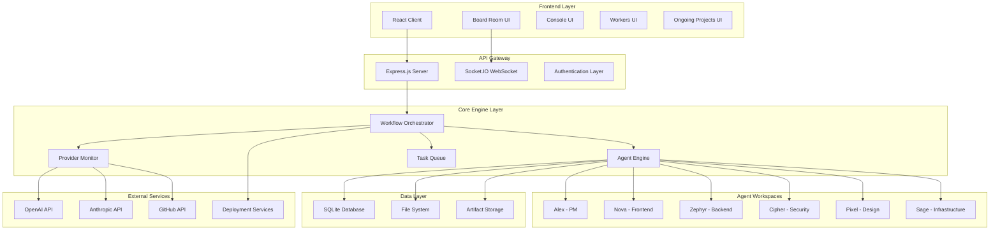
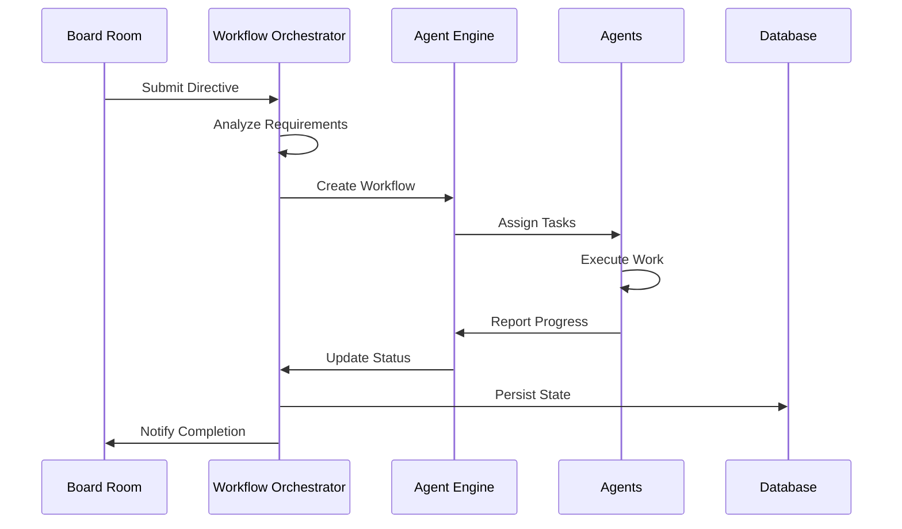
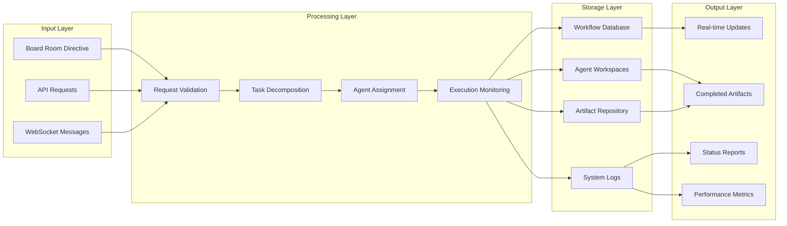
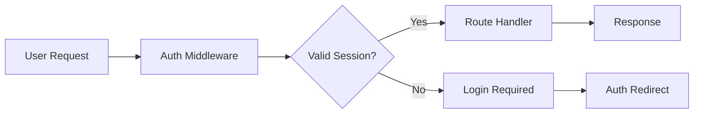

# System Architecture Overview

The ShellCompany platform is a sophisticated autonomous AI system designed to operate like a real company with specialized AI agents handling different business functions. This document provides a comprehensive overview of the system architecture, design principles, and key components.

## High-Level Architecture

## System Design Principles

### 1. Autonomous Operation
- **Self-Managing**: Agents operate independently with minimal human intervention
- **Collaborative**: Agents communicate and coordinate to complete complex tasks
- **Adaptive**: System adjusts to failures and changing requirements automatically

### 2. Redundancy & Reliability
- **Provider Failover**: Multiple AI providers ensure continued operation
- **Error Recovery**: Automatic retry mechanisms and fallback strategies
- **Health Monitoring**: Continuous monitoring of all system components

### 3. Scalability
- **Agent Expansion**: Easy addition of new specialized agents
- **Horizontal Scaling**: Components designed for distributed operation
- **Resource Management**: Efficient allocation of computational resources

### 4. Security & Compliance
- **Authentication**: Secure access control and session management
- **Data Protection**: Encrypted storage and secure communications
- **Audit Trail**: Comprehensive logging of all system activities

## Core Components

### Frontend (React Application)
The user interface provides real-time visibility into the autonomous company operations:

- **Board Room**: Strategic directive input and high-level oversight
- **Console**: Real-time system logs and debugging interface
- **Workers**: Agent status monitoring and workspace management
- **Ongoing Projects**: Project tracking and workflow visualization

### Backend (Node.js/Express)
The server layer manages all business logic and coordination:

- **RESTful API**: Standard HTTP endpoints for data operations
- **WebSocket Server**: Real-time communication with frontend
- **Authentication**: Session management and access control
- **File Management**: Agent workspace and artifact handling

### Workflow Orchestrator
The brain of the autonomous system:

### Agent Engine
Manages the lifecycle and coordination of all AI agents:

- **Task Assignment**: Intelligent distribution of work based on agent capabilities
- **Communication**: Inter-agent messaging and collaboration
- **Workspace Management**: Isolated environments for each agent
- **Progress Tracking**: Real-time monitoring of agent activities

### Provider Monitor
Ensures reliable AI service availability:

- **Health Checks**: Continuous monitoring of AI provider status
- **Load Balancing**: Intelligent routing based on provider performance
- **Failover Logic**: Automatic switching between providers
- **Cost Optimization**: Provider selection based on cost and performance metrics

## Data Flow Architecture

## Technology Stack

### Frontend Technologies
- **React 19**: Modern UI framework with concurrent features
- **Socket.IO Client**: Real-time communication
- **CSS3**: Modern styling with flexbox and grid
- **WebSocket**: Live updates and notifications

### Backend Technologies
- **Node.js**: JavaScript runtime for server-side logic
- **Express.js**: Web application framework
- **Socket.IO**: Real-time bidirectional communication
- **SQLite**: Embedded database for data persistence
- **Sequelize**: Object-relational mapping (ORM)

### Development Tools
- **npm**: Package management and dependency resolution
- **nodemon**: Development server with hot reloading
- **Jest**: Testing framework for unit and integration tests
- **ESLint**: Code quality and style enforcement

### External Integrations
- **OpenAI API**: Primary AI provider for language models
- **Anthropic Claude**: Secondary AI provider for redundancy
- **GitHub API**: Source code management integration
- **Various Deployment APIs**: Automated deployment capabilities

## Security Architecture

### Authentication & Authorization

### Data Security
- **Encryption at Rest**: Sensitive data encrypted in database
- **Encryption in Transit**: All communications use HTTPS/WSS
- **Access Control**: Role-based permissions for different functions
- **Audit Logging**: Complete trail of all system activities

## Performance Characteristics

### Response Times
- **API Endpoints**: < 100ms for standard operations
- **Agent Communication**: < 500ms for task assignment
- **Workflow Creation**: < 2 seconds for complex directives
- **Real-time Updates**: < 50ms WebSocket latency

### Scalability Metrics
- **Concurrent Users**: Supports 100+ simultaneous connections
- **Agent Capacity**: 37 specialized agents with room for expansion
- **Task Throughput**: 1000+ tasks per hour under normal load
- **Data Storage**: Efficient SQLite database with automatic optimization

## Monitoring & Observability

The system includes comprehensive monitoring at all levels:

- **Application Metrics**: Response times, error rates, throughput
- **Infrastructure Metrics**: CPU, memory, disk usage
- **Business Metrics**: Workflow completion rates, agent utilization
- **Real-time Dashboards**: Live system health visualization

---

This architecture supports the autonomous operation of ShellCompany while maintaining reliability, security, and scalability for future growth.
