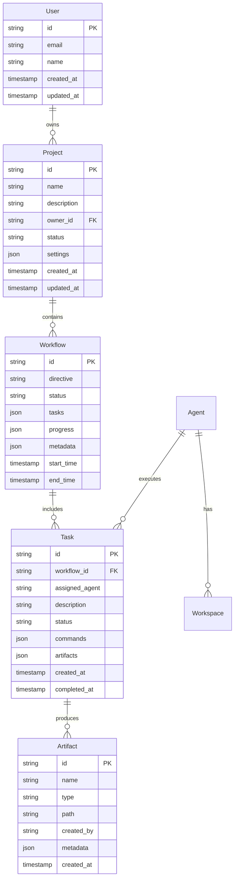
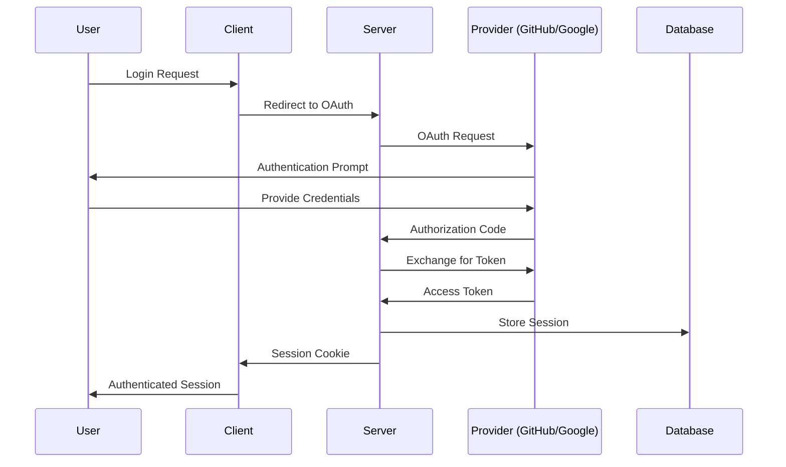

# Technology Stack Deep Dive

This document provides a comprehensive breakdown of all technologies, libraries, frameworks, and tools used in the ShellCompany platform, along with the rationale for each choice.

## Frontend Stack

### Core Framework
**React 19.1.1**
- **Why chosen**: Latest React with concurrent features for optimal performance
- **Key features**: Concurrent rendering, automatic batching, suspense improvements
- **Usage**: All UI components, state management, and user interactions

### Development Tools
**React Scripts 5.0.1**
- **Purpose**: Zero-configuration build tooling
- **Features**: Hot reloading, optimized production builds, testing integration
- **Configuration**: Minimal setup required, handles Webpack, Babel, ESLint automatically

### Styling & UI
**CSS3 with Modern Features**
- **Approach**: Component-scoped CSS files
- **Features**: Flexbox, Grid, CSS Variables, Animations
- **Files**: Individual `.css` files per component for maintainability

### Real-time Communication
**Socket.IO Client 4.8.1**
- **Purpose**: Bidirectional real-time communication with server
- **Features**: Auto-reconnection, event-based messaging, fallback mechanisms
- **Usage**: Live updates for workflows, agent status, console logs

### Additional Libraries
```json
{
  "axios": "^1.12.1",           // HTTP client for API calls
  "react-router-dom": "^7.9.1", // Client-side routing
  "uuid": "^13.0.0",            // Unique identifier generation
  "web-vitals": "^2.1.4"        // Performance monitoring
}
```

## Backend Stack

### Runtime & Framework
**Node.js with Express.js 4.18.2**
- **Why chosen**: JavaScript ecosystem consistency, excellent performance for I/O operations
- **Features**: Middleware support, routing, static file serving
- **Architecture**: RESTful API with WebSocket support

### Real-time Communication
**Socket.IO 4.8.1**
- **Purpose**: Server-side WebSocket management
- **Features**: Room-based messaging, namespace support, authentication
- **Usage**: Broadcasting workflow updates, agent communications, console logs

### Database & ORM
**SQLite 5.1.7 with Sequelize 6.37.7**
- **Why SQLite**: Embedded database, zero-configuration, excellent for development
- **Why Sequelize**: Robust ORM with migration support, model definitions, relationships
- **Features**: ACID compliance, concurrent access, automatic backups

### Authentication & Security
**Comprehensive Security Stack**
```javascript
// Security middleware stack
{
  "passport": "^0.7.0",              // Authentication framework
  "passport-github2": "^0.1.12",     // GitHub OAuth integration
  "passport-google-oauth20": "^2.0.0", // Google OAuth integration
  "bcryptjs": "^3.0.2",             // Password hashing
  "helmet": "^8.1.0",               // Security headers
  "express-rate-limit": "^8.1.0",   // Rate limiting
  "express-session": "^1.18.2",     // Session management
  "jsonwebtoken": "^9.0.2",         // JWT token handling
  "crypto-js": "^4.2.0"             // Encryption utilities
}
```

### Process & System Management
**Advanced Process Control**
```javascript
{
  "node-pty": "^1.0.0",    // Pseudo-terminal for agent workspaces
  "chokidar": "^3.6.0",    // File system watching
  "ws": "^8.14.2",         // Raw WebSocket support
  "uuid": "^13.0.0"        // Unique identifier generation
}
```

## Development & Testing

### Testing Framework
**Jest 29.7.0**
- **Purpose**: Unit and integration testing
- **Features**: Snapshot testing, mocking, code coverage
- **Configuration**: Custom setup for database tests, API testing

### Development Tools
```javascript
{
  "nodemon": "^3.0.2",     // Auto-restart during development
  "supertest": "^6.3.3",   // HTTP assertion testing
  "morgan": "^1.10.1",     // HTTP request logging
  "dotenv": "^17.2.2"      // Environment variable management
}
```

### Database Migrations
**Umzug 3.1.0**
- **Purpose**: Database schema versioning and migrations
- **Features**: Sequential migrations, rollback support, TypeScript integration
- **Usage**: Automated database schema updates

## External Integrations

### AI Providers
**Multi-Provider Architecture**
- **Primary**: OpenAI GPT models via REST API
- **Secondary**: Anthropic Claude for redundancy
- **Fallback**: Multiple provider switching for reliability
- **Features**: Cost optimization, performance monitoring, automatic failover

### Version Control
**GitHub Integration**
- **API**: GitHub REST API v4
- **Features**: Repository management, issue tracking, deployment hooks
- **Authentication**: OAuth2 with fine-grained permissions

### HTTP Client
**Axios 1.12.1**
- **Purpose**: External API communication
- **Features**: Request/response interceptors, timeout handling, error recovery
- **Usage**: AI provider APIs, GitHub API, deployment services

### File Operations
**Node.js Built-in Modules**
- **fs/promises**: Asynchronous file operations
- **path**: Cross-platform path manipulation
- **crypto**: Secure random generation, hashing
- **os**: System information and resource monitoring

## Data Storage Architecture

### Database Schema


### File System Organization
```
server/
├── agent-workspaces/          # Isolated agent environments
│   ├── alex-workspace/         # Project manager workspace
│   ├── nova-workspace/         # Frontend developer workspace
│   ├── zephyr-workspace/       # Backend developer workspace
│   ├── cipher-workspace/       # Security specialist workspace
│   ├── pixel-workspace/        # Design specialist workspace
│   └── sage-workspace/         # Infrastructure specialist workspace
├── artifacts/                 # Persistent artifact storage
├── config/                    # Configuration files
│   └── ai-workers/            # Agent configuration
├── models/                    # Database model definitions
├── services/                  # Core business logic
├── routes/                    # API endpoint definitions
└── migrations/                # Database schema versions
```

## Performance Optimizations

### Frontend Optimizations
- **Code Splitting**: Dynamic imports for route-based chunks
- **Memoization**: React.memo and useMemo for expensive operations
- **Virtual Scrolling**: Efficient rendering of large lists
- **Debounced Updates**: Reduced API calls for real-time features

### Backend Optimizations
- **Connection Pooling**: Efficient database connection management
- **Caching**: In-memory caching for frequently accessed data
- **Streaming**: Large file transfers via streams
- **Background Processing**: Non-blocking operations for heavy tasks

### Database Optimizations
- **Indexes**: Strategic indexing on frequently queried columns
- **Transactions**: ACID compliance for data consistency
- **Query Optimization**: Efficient joins and subqueries
- **Automatic Vacuum**: SQLite maintenance for optimal performance

## Monitoring & Observability

### Logging Architecture
```javascript
// Comprehensive logging system
const logger = {
  levels: ['error', 'warn', 'info', 'debug'],
  transports: ['console', 'file', 'websocket'],
  features: ['structured_logging', 'log_rotation', 'real_time_streaming']
};
```

### Health Monitoring
- **Application Health**: Response times, error rates, throughput
- **System Health**: CPU, memory, disk usage, network metrics
- **Business Metrics**: Workflow completion rates, agent utilization
- **External Dependencies**: AI provider health, GitHub API status

### Performance Metrics
```javascript
// Key performance indicators
const metrics = {
  response_times: {
    p50: "< 100ms",
    p95: "< 500ms",
    p99: "< 1000ms"
  },
  throughput: {
    requests_per_second: "1000+",
    concurrent_workflows: "50+",
    agent_tasks_per_hour: "1000+"
  },
  reliability: {
    uptime: "99.9%",
    error_rate: "< 0.1%",
    failover_time: "< 5 seconds"
  }
};
```

## Security Implementation

### Authentication Flow


### Data Protection
- **Encryption at Rest**: Sensitive database fields encrypted
- **Encryption in Transit**: All communications over HTTPS/WSS
- **Input Validation**: Comprehensive sanitization and validation
- **CSRF Protection**: Cross-site request forgery prevention
- **XSS Protection**: Content Security Policy and input escaping

## Deployment Architecture

### Development Environment
```bash
# Local development stack
npm run dev          # Concurrent client/server development
npm run client       # Frontend development server (port 3000)
npm run server       # Backend development server (port 3001)
npm test            # Run test suite
npm run migrate     # Run database migrations
```

### Production Considerations
- **Process Management**: PM2 for production process management
- **Reverse Proxy**: Nginx for static file serving and load balancing
- **SSL Termination**: Automated certificate management
- **Health Checks**: Kubernetes-style health endpoints
- **Graceful Shutdown**: Proper cleanup on process termination

## Future Architecture Considerations

### Scalability Roadmap
- **Microservices**: Break monolith into focused services
- **Container Orchestration**: Kubernetes deployment for scalability
- **Database Scaling**: PostgreSQL migration for production workloads
- **Caching Layer**: Redis for distributed caching

### Technology Evolution
- **AI Provider Expansion**: Additional AI providers for redundancy
- **Real-time Collaboration**: Enhanced multi-user support
- **Mobile Support**: React Native mobile application
- **API Gateway**: Centralized API management and rate limiting

---

This technology stack provides a solid foundation for the autonomous AI company platform while maintaining flexibility for future enhancements and scaling requirements.
