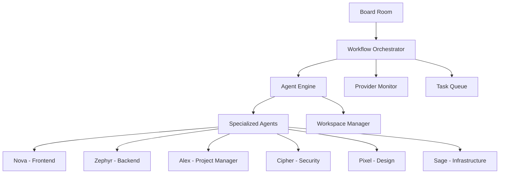

# ShellCompany Platform Documentation

Welcome to the comprehensive documentation for **ShellCompany** - an autonomous AI company platform that orchestrates intelligent agents to handle complex business workflows.

## 🚀 Quick Start

This documentation covers every aspect of the ShellCompany platform, from high-level architecture to individual file documentation. Use the sidebar navigation to explore different sections.

### Platform Overview

ShellCompany is a revolutionary autonomous AI platform that operates like a real company with specialized AI agents handling different roles - from project management to development, design, security, and infrastructure.

## 📚 Documentation Sections

### 🏗️ [System Architecture](/architecture/overview)
Complete system architecture, tech stack, and deployment strategies.

### ⚙️ [Engines & Core Services](/engines/overview)
Deep dive into the orchestrator, agent engine, and provider monitoring systems.

### 🔄 [Workflows & Processes](/workflows/overview)
Detailed workflow lifecycle from board room directives to completion.

### 🎨 [UI & User Experience](/ui/overview)
Frontend components, user journeys, and design system documentation.

### 🗄️ [Data & Persistence](/data/overview)
Database schema, models, artifacts, and persistence strategies.

### 🤖 [Agents & Company Structure](/agents/overview)
Complete agent roster, roles, responsibilities, and interaction patterns.

### 📊 [Metrics & Monitoring](/metrics/overview)
Performance metrics, monitoring dashboards, and system health indicators.

### 🔧 [API Reference](/api/overview)
Complete API documentation with endpoints, authentication, and examples.

### 📁 [File Documentation](/files/overview)
File-by-file documentation of the entire codebase.

### 🚀 [Deployment & Operations](/deployment/overview)
Deployment guides, operations procedures, and monitoring setup.

## 🎯 Key Features

- **Autonomous Workflow Execution**: AI agents work together to complete complex tasks
- **Real-time Collaboration**: Agents communicate and coordinate in real-time
- **Provider Redundancy**: Multiple AI provider fallbacks ensure reliability
- **Visual Management**: Interactive dashboards for monitoring and control
- **Artifact Management**: Comprehensive tracking of all work products
- **Quality Assurance**: Built-in review processes and approval gates

## 🏢 Company Structure

The platform operates with a sophisticated organizational structure:

- **Board Room**: Strategic directive input and high-level decision making
- **Management Layer**: Project coordination and workflow orchestration  
- **Specialist Agents**: Domain experts handling specific technical areas
- **Review & Quality**: Continuous review and approval processes
- **CEO Oversight**: Final approval and strategic guidance

## 🔍 Navigation Tips

- Use the **sidebar** to navigate between sections
- Each section includes **live diagrams** and **interactive examples**
- **Code snippets** are provided for all technical implementations
- **Mermaid diagrams** show system flows and relationships
- **Charts and metrics** demonstrate real system performance

## 🆘 Getting Help

- Check the specific section documentation for detailed information
- Review the [API Reference](/api/overview) for integration details
- Explore [File Documentation](/files/overview) for implementation specifics
- Visit the [GitHub repository](https://github.com/BradleyMatera/ShellCompany) for source code

---

**Last Updated**: {new Date().toLocaleDateString()}  
**Platform Version**: 1.0.0  
**Documentation Version**: 1.0.0
