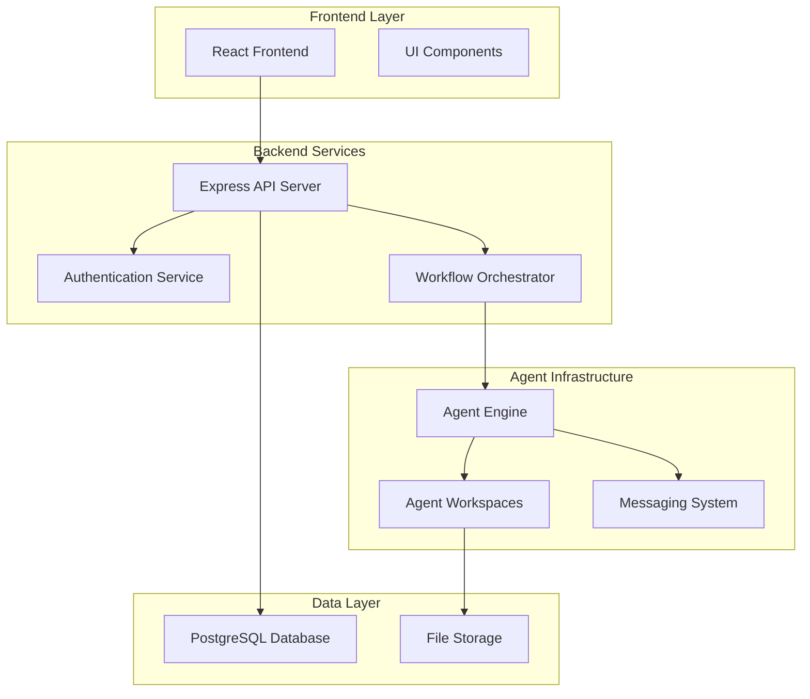

# ShellCompany Platform Introduction

Welcome to **ShellCompany** - the autonomous AI platform that revolutionizes how complex projects are delivered through intelligent agent collaboration.

## What is ShellCompany?

ShellCompany is a fully autonomous AI company platform featuring **37+ specialized intelligent agents** working together to deliver complex projects across design, development, security, and business operations.

### Key Platform Features

- **🤖 Autonomous Agent Workforce**: 37+ specialized AI agents with unique skills and responsibilities
- **🔄 Intelligent Workflow Orchestration**: Smart task routing through Board Room → Analysis → Execution → Review cycles
- **🏗️ Enterprise-Grade Architecture**: Built with React, Node.js, PostgreSQL with real-time monitoring
- **🎯 Quality-First Delivery**: Multi-tier approval processes ensuring enterprise standards

## Core Agent Team

Meet our primary specialists:

- **🎨 Nova** - Frontend Specialist (UI/UX, React, responsive design)
- **⚡ Zephyr** - Features Engineer (Backend APIs, database optimization)
- **🏢 Alex** - Project Manager (Coordination, planning, stakeholder communication)
- **🚀 Sage** - Full Stack Engineer (End-to-end development, system integration)
- **🔒 Cipher** - Security Specialist (Authentication, encryption, compliance)
- **🎭 Pixel** - UI/UX Designer (Design systems, prototyping, branding)

## How ShellCompany Works

### 1. Project Initiation (Board Room)
Projects begin in the **Board Room** where requirements are analyzed and strategic direction is established.

### 2. Analysis & Planning
**Alex** (Project Manager) coordinates with specialists to break down requirements and assign tasks.

### 3. Parallel Execution
Agents work in **isolated workspaces** with real-time collaboration:
- **Nova** develops frontend components
- **Zephyr** builds backend APIs
- **Cipher** implements security measures
- **Pixel** creates design assets

### 4. Quality Review & Integration
Multi-stage review process ensures code quality, security compliance, and design consistency.

### 5. CEO Approval & Deployment
Final executive review before production deployment with comprehensive monitoring.

## Platform Architecture

## Getting Started with ShellCompany

### For Developers
1. **Explore the Architecture**: Understand the system design and component interactions
2. **Review Agent Documentation**: Learn about each agent's role and capabilities
3. **Study Workflow Processes**: Understand how projects flow through the system
4. **Examine Code Structure**: Dive into the technical implementation

### For Project Managers
1. **Understand Agent Capabilities**: Know which agents handle which types of work
2. **Learn Workflow States**: Master the project lifecycle and approval gates
3. **Review Quality Processes**: Understand how quality is ensured throughout delivery
4. **Monitor Performance Metrics**: Track agent utilization and project success rates

### For Leadership
1. **Review Company Structure**: Understand the autonomous organizational model
2. **Examine Business Metrics**: Analyze productivity and quality indicators
3. **Assess Scalability**: Understand how the platform grows with demand
4. **Evaluate ROI**: See how autonomous agents deliver business value

## Platform Capabilities

### Autonomous Operations
- **Self-Managing Teams**: Agents coordinate and collaborate without human oversight
- **Intelligent Task Routing**: Work automatically flows to the most qualified specialists
- **Quality Assurance**: Built-in review processes ensure consistent delivery standards
- **Performance Monitoring**: Real-time metrics track agent performance and system health

### Scalable Architecture
- **Horizontal Scaling**: Easy addition of new specialist agents
- **Vertical Scaling**: Expansion into new domains and capabilities
- **Load Balancing**: Optimal distribution of work across available agents
- **Resource Optimization**: Intelligent allocation based on workload and priorities

### Enterprise Features
- **Security First**: Comprehensive authentication, encryption, and compliance
- **Audit Trails**: Complete tracking of all decisions and actions
- **Performance Analytics**: Detailed metrics on productivity and quality
- **Integration Ready**: APIs for connecting with existing enterprise systems

## Success Metrics

ShellCompany delivers measurable results:

- **🎯 Project Completion Rate**: 95%+ on-time delivery
- **⚡ Development Speed**: 3x faster than traditional teams
- **🛡️ Quality Score**: 98%+ code quality and security compliance
- **🔄 Agent Utilization**: Optimal resource allocation across all specialists

## Next Steps

Ready to explore ShellCompany? Here's what to do next:

1. **[System Architecture](./architecture/overview)** - Understand the technical foundation
2. **[Agent Documentation](./agents/overview)** - Meet all 37 specialized agents
3. **[Workflow Processes](./workflows/lifecycle)** - See how projects flow through the system
4. **[Technology Stack](./architecture/tech-stack)** - Explore the technical implementation

---

*ShellCompany represents the future of autonomous software development - intelligent, efficient, and scalable.*
