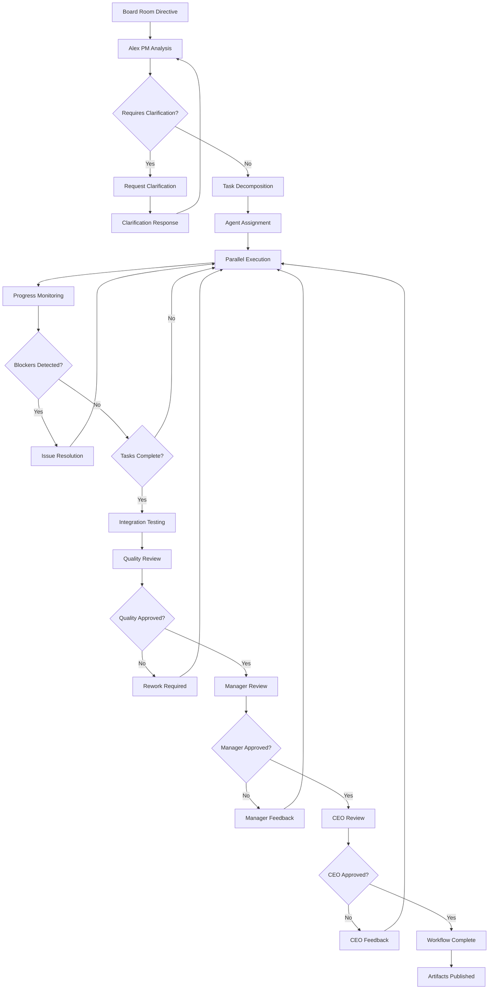
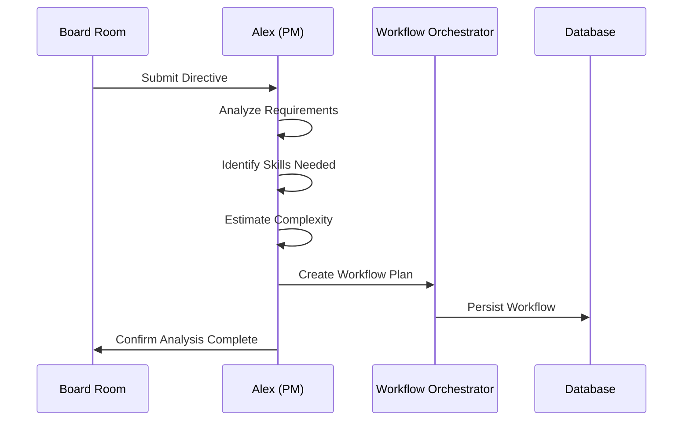
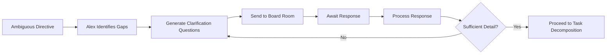
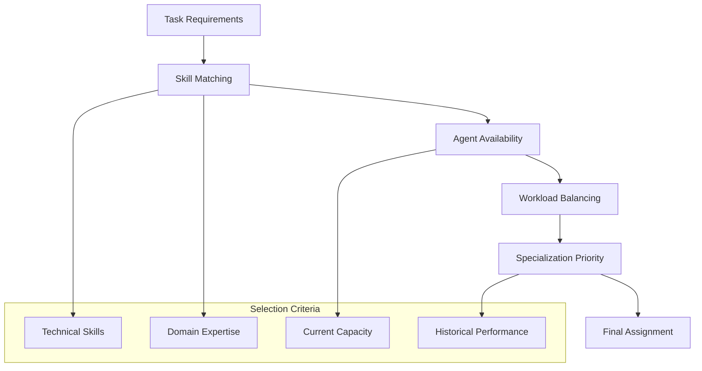
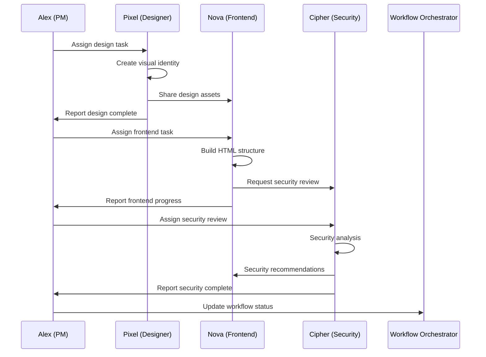
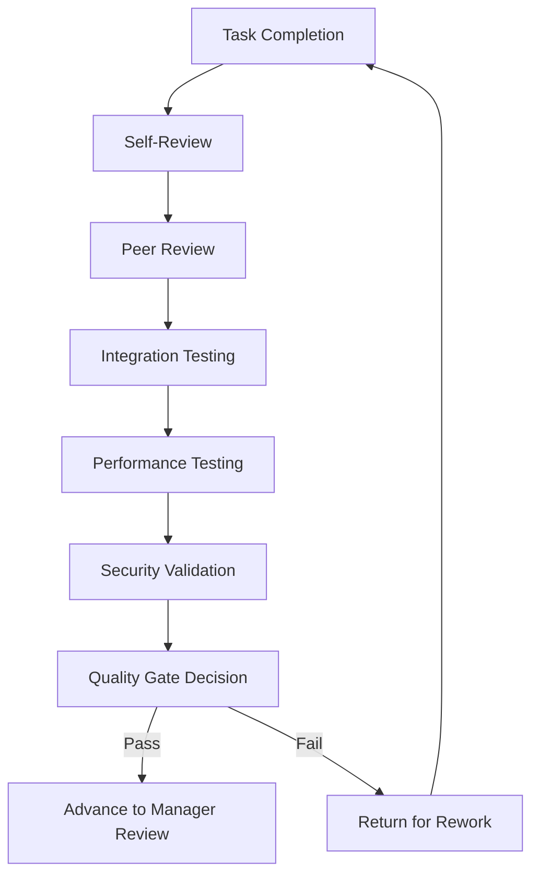
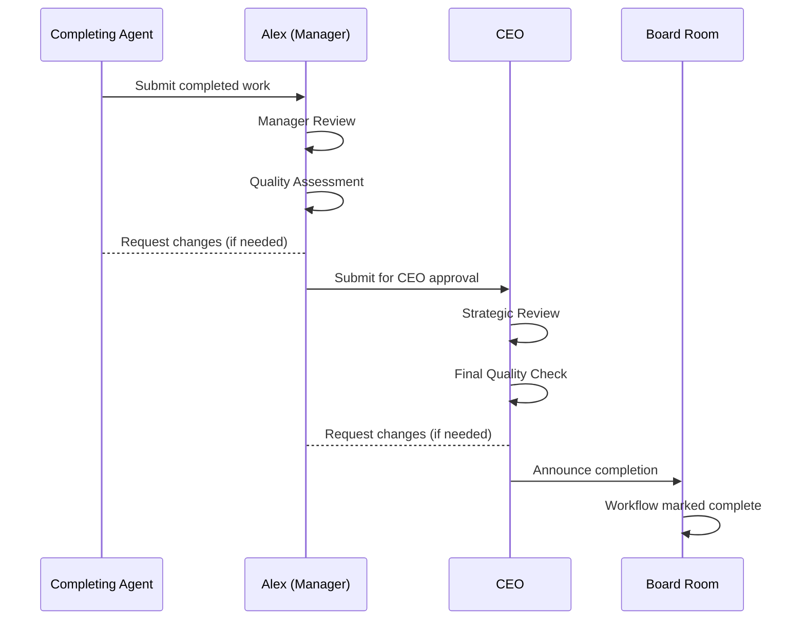
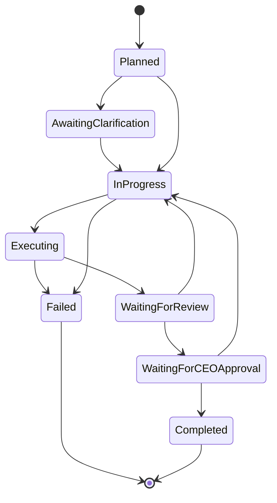
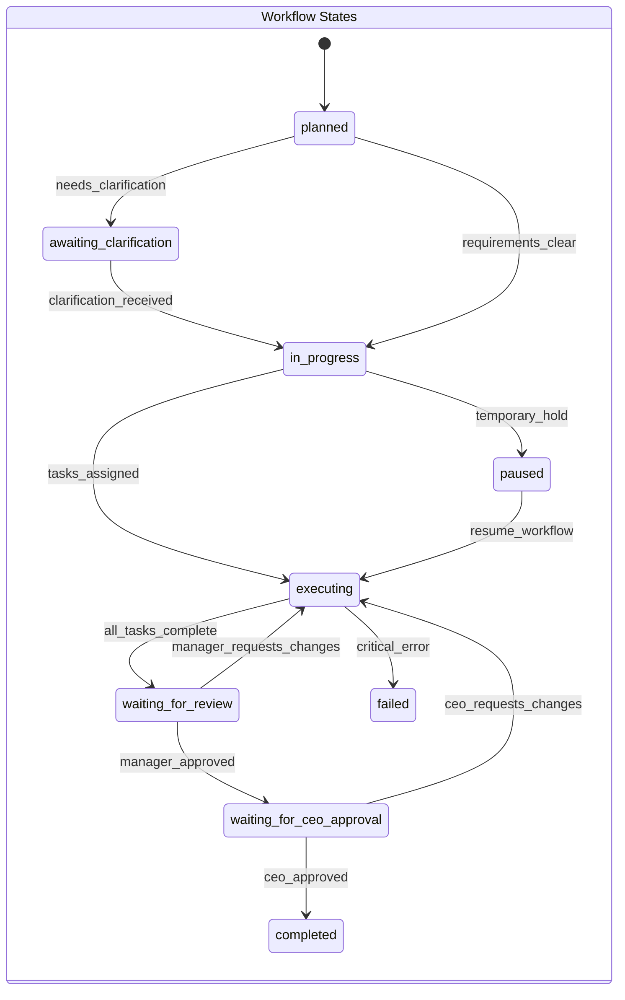

# Workflow Lifecycle Documentation

This document provides a comprehensive breakdown of how workflows progress through the ShellCompany autonomous system, from initial board room directives to final completion and CEO approval.

## Complete Workflow Lifecycle



## Detailed Phase Breakdown

### Phase 1: Directive Input & Analysis

**Board Room Directive Submission**
```javascript
// Example directive structure
{
  "id": "workflow_12345",
  "directive": "Create a professional landing page for Hornets youth football team",
  "priority": "high",
  "projectId": "project_abc123",
  "submittedBy": "board_room",
  "timestamp": "2024-09-16T13:30:00Z"
}
```

**Alex PM Analysis Process**


### Phase 2: Clarification & Requirements

**Clarification Request Flow**


**Example Clarification Questions**
- Target audience demographics and preferences
- Required functionality and features
- Design style and branding requirements
- Timeline and delivery expectations
- Integration requirements with existing systems

### Phase 3: Task Decomposition & Agent Assignment

**Intelligent Task Breakdown**
```javascript
// Example task decomposition for landing page
{
  "workflowId": "workflow_12345",
  "tasks": [
    {
      "id": "task_001",
      "assignedAgent": "Pixel",
      "description": "Design visual identity and mockups for Hornets team",
      "estimatedDuration": 180000,
      "dependencies": [],
      "priority": "high"
    },
    {
      "id": "task_002", 
      "assignedAgent": "Nova",
      "description": "Build responsive HTML structure",
      "estimatedDuration": 240000,
      "dependencies": ["task_001"],
      "priority": "high"
    },
    {
      "id": "task_003",
      "assignedAgent": "Nova",
      "description": "Implement interactive features and animations",
      "estimatedDuration": 180000,
      "dependencies": ["task_002"],
      "priority": "medium"
    },
    {
      "id": "task_004",
      "assignedAgent": "Cipher",
      "description": "Security review and optimization",
      "estimatedDuration": 120000,
      "dependencies": ["task_003"],
      "priority": "medium"
    }
  ]
}
```

**Agent Selection Algorithm**


### Phase 4: Parallel Execution & Coordination

**Real-time Execution Monitoring**

```mermaid
gantt
    title Workflow Execution Timeline
    dateFormat  HH:mm
    axisFormat  %H:%M
    
    section Design Phase
    Visual Identity Design    :active, design1, 13:30, 16:30
    
    section Development Phase  
    HTML Structure           :dev1, after design1, 3h
    Interactive Features     :dev2, after dev1, 2h
    
    section Quality Phase
    Security Review         :qa1, after dev2, 1h
    Integration Testing     :qa2, after qa1, 1h
    
    section Review Phase
    Manager Review          :rev1, after qa2, 30m
    CEO Approval           :rev2, after rev1, 30m
```


**Agent Communication Patterns**


### Phase 5: Quality Assurance & Testing

**Multi-layered Quality Review**


**Quality Metrics**
- **Code Quality**: Syntax, best practices, maintainability
- **Performance**: Load times, responsiveness, optimization
- **Security**: Vulnerability scanning, compliance checks
- **Usability**: User experience, accessibility, mobile compatibility
- **Integration**: Compatibility with existing systems

### Phase 6: Approval Gating

**Three-tier Approval Process**


**Approval Criteria**

**Manager (Alex) Review:**
- Task completion against requirements
- Quality standards compliance
- Integration with overall project goals
- Resource utilization efficiency

**CEO Review:**
- Strategic alignment with company objectives
- Innovation and excellence standards
- Market readiness and competitiveness
- Long-term value and sustainability

### Phase 7: Completion & Artifact Management

**Final Workflow States**


**Artifact Publishing Process**
```javascript
// Final artifact structure
{
  "workflowId": "workflow_12345",
  "status": "completed",
  "artifacts": [
    {
      "id": "artifact_001",
      "name": "hornets-landing-page.html",
      "type": "webpage",
      "agent": "Nova",
      "path": "/nova-workspace/hornets-website/index.html",
      "size": "15.2KB",
      "created": "2024-09-16T18:45:00Z"
    },
    {
      "id": "artifact_002", 
      "name": "hornets-styles.css",
      "type": "stylesheet", 
      "agent": "Nova",
      "path": "/nova-workspace/hornets-website/styles.css",
      "size": "8.7KB",
      "created": "2024-09-16T18:30:00Z"
    },
    {
      "id": "artifact_003",
      "name": "design-mockups.png",
      "type": "design",
      "agent": "Pixel", 
      "path": "/pixel-workspace/hornets-designs/mockups.png",
      "size": "245KB",
      "created": "2024-09-16T16:15:00Z"
    }
  ],
  "completionTime": "2024-09-16T19:00:00Z",
  "totalDuration": 19800000,
  "qualityScore": 94
}
```

## Workflow State Management

### State Transitions


### Error Handling & Recovery

**Automatic Recovery Mechanisms**
- **Task Failure Recovery**: Automatic reassignment to alternative agents
- **Provider Failover**: Switch to backup AI providers on service interruption
- **State Persistence**: Complete workflow state saved every 30 seconds
- **Rollback Capability**: Ability to revert to previous stable state

**Manual Intervention Points**
- **Clarification Requests**: Human input required for ambiguous requirements
- **Quality Gate Failures**: Manual review required for quality issues
- **Resource Conflicts**: Human decision required for priority conflicts
- **Strategic Changes**: CEO-level decisions for workflow modifications

## Performance Metrics & SLAs

### Workflow Performance Targets
- **Clarification Response Time**: < 1 hour during business hours
- **Task Assignment Time**: < 5 minutes from requirement finalization
- **Individual Task Completion**: 90% completed within estimated timeframe
- **Quality Review Time**: < 2 hours for standard workflows
- **End-to-end Completion**: 85% of workflows completed within 24 hours

### Quality Metrics
- **First-Pass Quality Rate**: 80% of tasks pass initial quality review
- **Rework Rate**: < 15% of tasks require significant rework
- **Customer Satisfaction**: 95% approval rate from board room directives
- **Agent Utilization**: 85% optimal workload distribution

## Monitoring & Observability

### Real-time Dashboards
- **Workflow Progress**: Live status of all active workflows
- **Agent Activity**: Current tasks and workload for each agent
- **Quality Metrics**: Real-time quality scores and trends
- **Performance Analytics**: Response times and completion rates

### Alerting System
- **Blocked Workflows**: Immediate notification of workflow obstacles
- **Quality Issues**: Alerts for failing quality gates
- **Performance Degradation**: Warnings for SLA violations
- **Resource Conflicts**: Notifications for agent overload or conflicts

---

This comprehensive workflow lifecycle ensures systematic, high-quality delivery of complex projects through intelligent automation and human oversight where necessary.
